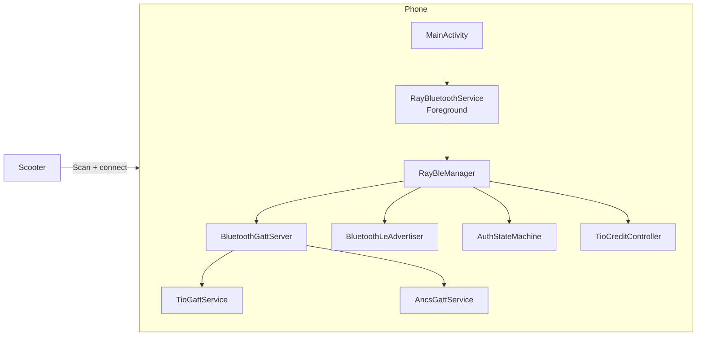

# RayZ Vehicle Connect

Android-App, die sich gegenueber einem Ray-Scooter wie die Original-App
verhaelt: sie ist **GATT-Server (Peripheral)** und bietet die beiden BLE-
Services TIO und ANCS an. Der Scooter scannt nach uns, verbindet sich
und tauscht ueber den TIO-UART-Tunnel Daten aus.

## Architektur



Wesentliche Klassen:

| Klasse | Aufgabe |
|--------|---------|
| `RayUuids` | Zentrale Konstanten fuer TIO/ANCS/CCCD UUIDs |
| `TioGattService` | TIO-Service mit RX/TX/Credits-RX/Credits-TX |
| `AncsGattService` | ANCS-Service Notification-Source/Data-Source/Control-Point |
| `RayBleManager` | Oeffnet `BluetoothGattServer`, startet Advertising, fuehrt State-Maschinen |
| `AuthStateMachine` | `RX_KEY_ID -> RX_AUTH_MSG -> RX_RANDOM_NUMS -> RX_CONNECTION_FRAME -> SUCCESS` |
| `TioCreditController` | Credit-basierte Flow-Control, Max 25 (`0x19`) |
| `RayBluetoothService` | Foreground-Service mit `FOREGROUND_SERVICE_TYPE_CONNECTED_DEVICE` |

Alle Klassen sind 1:1-Ports aus den Smali-Dateien unter
`../ray_decompiled/smali/` (siehe dortige `README.md`).

## Voraussetzungen

- Android 7 (API 24) oder neuer – `minSdk` ist allerdings 21, getestet
  wird primaer ab API 31, weil die neuen Bluetooth-Permissions dort
  greifen.
- Bluetooth + BLE Advertising muss vom Geraet unterstuetzt sein
  (`android.hardware.bluetooth_le`).
- Android SDK Platform 34, Build-Tools 34.0.0, JDK 17.

## Bauen und installieren

### CI

Der GitHub Actions Workflow `.github/workflows/gradle.yml` baut
`assembleDebug` und fuehrt `testDebugUnitTest` aus, sobald nach
`rayz-app` gepusht wird oder ein PR auf den Branch geht.

### Lokal

```bash
cd RayZ_APP
./gradlew assembleDebug testDebugUnitTest
```

Oder, wenn ein Geraet/Emulator angeschlossen ist:

```bash
./build_and_install.sh
```

Standardpfad fuer den Android SDK ist `$ANDROID_HOME` bzw.
`local.properties`. Auf macOS mit Homebrew funktioniert auch
`/opt/homebrew/share/android-commandlinetools`.

## Tests

```bash
cd RayZ_APP
./gradlew :app:testDebugUnitTest
```

Aktuell 41 Unit-Tests (JUnit 4 + Robolectric 4.13), darunter:

- `RayUuidsTest` – UUIDs gegen die Smali-Quellen fixiert.
- `TioGattServiceTest` / `AncsGattServiceTest` – Properties, Permissions,
  CCCD-Descriptoren in beiden Security-Modi.
- `AuthStateMachineTest` – Happy Path, Refuse, Reset, Ordinal-Stabilitaet.
- `TioCreditControllerTest` – Unsigned-Parsing, Clamp auf `0x19`,
  consumeOne, Reset.
- `RayBleManagerTest` – `openGattServer`, Connect/Disconnect,
  Credits-Write -> `TIO_CONNECTED`, 4x TIO RX -> `AUTH_CONNECTED`.

## UI

Eine einzige Activity mit zwei Karten:

1. **Status-Karte** – farbcodierter Verbindungsstatus
   (`NOT_CONNECTED`, `CONNECTING`, `GATT_CONNECTED`, `TIO_CONNECTED`,
   `AUTH_CONNECTED`).
2. **Debug-Karte** – Connection-State, Auth-State, Credit-Counter,
   verbundenes Geraet (MAC), Hex-Dump des letzten TIO-RX-Frames.

Zwei Buttons: *Advertising starten/stoppen* und *Verbindung trennen*.

Es gibt **keinen Scan mehr** – die App ist Peripheral.

## Berechtigungen

Aktuelle Manifest-Permissions:

| Permission | Wozu |
|------------|------|
| `BLUETOOTH_SCAN` (`neverForLocation`) | Standard fuer Adapter-Operationen ab Android 12 |
| `BLUETOOTH_CONNECT` | GATT-Server, Geraete-Interaktion |
| `BLUETOOTH_ADVERTISE` | LE-Advertising |
| `FOREGROUND_SERVICE` + `_CONNECTED_DEVICE` | Persistenter BLE-Service |
| `POST_NOTIFICATIONS` | Foreground-Service-Notification ab Android 13 |
| `BLUETOOTH` / `BLUETOOTH_ADMIN` / `ACCESS_FINE_LOCATION` | Legacy Android 11 und aelter |

## Was bewusst noch fehlt

- Die TIO-Payload (Speed/Battery/…) wird noch nicht dekodiert. Erst
  wenn die Auth-Frames vom realen Scooter im Hex-Dump sichtbar sind,
  laesst sich das Protokoll oberhalb der UART-Ebene seriose mappen.
- Die ANCS-Pipeline (Notification-Listener-Service, App-Filter) ist
  noch nicht angebunden – aktuell wird nur der GATT-Service exponiert.
- Krypto/Schluesselmaterial fuer den Auth-Handshake muss noch aus
  `ray_decompiled/smali/o/c/a/h.smali` und `d.smali` extrahiert werden.

## Logs

```bash
adb logcat -s RayBleManager RayBluetoothService BluetoothGattServer BluetoothManager
```

## Lizenz

Reverse-Engineering- und Lern-Projekt, kein offizieller Ray-Build.
